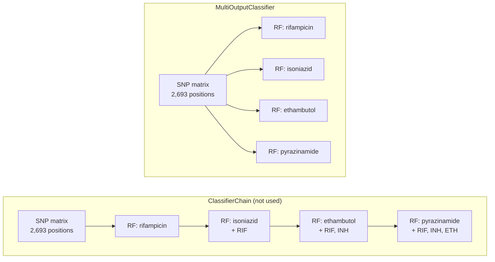

In the FORUM-TB project, instead of four separate per-drug classifiers, we wrapped the same Random Forest (300 trees, `class_weight="balanced"`) in scikit-learn's `MultiOutputClassifier` and asked this multi-label model to predict resistance to <u>rifampicin, isoniazid, ethambutol, and pyrazinamide</u> simultaneously, from one isolate, in one pass, on the 5,180 isolates in our cohort with phenotype labels for all four drugs (code in [`scripts/benchmark_multi.py`](https://github.com/TheMicrobialist/SHAP-mTB-AMR)).

The per-drug numbers, from four independently trained Random Forests, are strong on their own: cross-validated AUC-ROC of 0.969 for rifampicin, 0.946 for isoniazid, 0.900 for ethambutol, and 0.883 for pyrazinamide. The multi-label model, predicting the same four drugs at once, tells two different stories. Per-drug discrimination barely moves, its macro AUC-ROC across all four drugs is 0.919, with a Hamming loss (the fraction of individual drug labels it gets wrong) of just 0.136, but subset accuracy, **the fraction of isolates where all four predictions are simultaneously correct, drops to 0.591.**

![[mtb-two-mutations-shared-node-white.png]]

A number that low invites a look at how the multi-label model was built. The input is the same 2,693-position genomic SNP matrix used for each per-drug model. The output is four resistance labels, one per drug. The wrapper, [`MultiOutputClassifier`](https://scikit-learn.org/stable/modules/generated/sklearn.multioutput.MultiOutputClassifier.html), fits one classifier per target: one `RandomForestClassifier` for rifampicin, a second for isoniazid, a third for ethambutol, a fourth for pyrazinamide. It does not learn the four drugs jointly. 

(Scikit-learn has a tool that does, [`ClassifierChain`](https://scikit-learn.org/stable/modules/generated/sklearn.multioutput.ClassifierChain.html), described in its own documentation as "capable of exploiting correlations among targets," as shown in figure 1. Will explore later.) 

What we ran trains four separate `RandomForestClassifier` models, 300 trees each with `class_weight="balanced"`, exactly as in the per-drug runs, and holds them in one object fitted and called in a single step. The design is called a first-order strategy, and its canonical form, Binary Relevance, dates to Boutell and colleagues' 2004 work on scene classification (*Pattern Recognition* 37:1757). They describe it as "extremely straightforward" and note it "has been employed as the building block of many state-of-the-art multi-label learning techniques," while naming the cost: it "completely ignores potential correlations among labels." So the four Random Forests are unchanged from the per-drug runs. Only the packaging is new. Anything measured one drug at a time carries over almost intact. AUC-ROC is still computed per drug with `roc_auc_score`, and the macro figure is the mean of those four. Subset accuracy is the exception. It scores all four labels of an isolate together and counts the isolate correct only when every label is right. In scikit-learn it is `accuracy_score`, which becomes subset accuracy the moment it is handed four columns instead of one.

***Figure 1. Two ways to predict four drugs from one genome.** Above, `MultiOutputClassifier`, the design used here: four Random Forests trained on the same feature matrix, each blind to the other three, so nothing about rifampicin resistance can inform the pyrazinamide call. Below, `ClassifierChain`: every classifier still receives the full SNP matrix, and each one after the first also receives the resistance calls made before it, so co-resistance structure can propagate along the chain. Only the first link is drawn from the matrix for clarity. The chain order is arbitrary and matters, which is why chains are usually trained in several random orders and averaged.*

AUC-ROC summarises how well a model separates resistant from susceptible isolates across every possible decision threshold, so it does not depend on where the cutoff is drawn. Chance is 0.5 and perfect is 1.0 ([Fawcett 2006](https://ui.adsabs.harvard.edu/abs/2006PaReL..27..861F/abstract)). Hamming loss is the fraction of individual drug labels called wrongly, averaged across every isolate and drug, so lower is better. Subset accuracy is the strict one, and it is where the four drugs stop being four separate questions.

Calling the fitted object returns four probabilities, one per drug, and each is thresholded at 0.5 into a resistant or susceptible call. Take rifampicin as the reference. Its AUC-ROC of 0.969 means that given one resistant and one susceptible isolate at random, the model scores the resistant one higher about 97% of the time. The other three drugs are scored the same way and entirely separately. Hamming loss then counts how many of the four calls were wrong, one drug at a time. Subset accuracy asks the different question: were all four right for this isolate? The demonstration isolate ERR040120, an MDR strain, comes back at 1.00 for rifampicin, 1.00 for isoniazid, 0.73 for ethambutol and 0.85 for pyrazinamide from the per-drug models, which are the same estimators the wrapper holds. All four cross the threshold, all four are correct, so this isolate contributes a full point to subset accuracy. One wrong call anywhere in that row and it contributes nothing.

The gap is not created by the wrapper. Any model scored by exact match faces a harder question than the same model scored one drug at a time, whether its four classifiers are independent or chained. What the wrapper changes is how much room is left to improve, not whether the two numbers can diverge. The divergence itself is about what is being asked. Traditional single-label learning assumes that "each example belongs to only one concept." That assumption is perfectly fine for *is this isolate resistant to rifampicin?*, one isolate, one label, one answer. It is not fine as a description of the isolate itself. For example, a news article can be simultaneously about sports, the Olympics, ticket sales, and the torch relay, with no single topic more "correct" than the others. An MDR-TB isolate is the same: it is resistant to rifampicin *and* isoniazid at once, through two mechanistically independent mutations (*rpoB* and *katG*) that happen to travel together. Thus, the per-drug models answer four separate yes-or-no questions; the multi-label setting asks a single question about the whole isolate, ***which drugs is this resistant to?*** 

**The drop is arithmetic.** Subset accuracy, also called the exact match ratio, counts a prediction as correct only when all four drug labels are right at once. Three of four still scores as wrong. That is the metric behaving as defined: scikit-learn specifies that "the set of labels predicted for a sample must exactly match the corresponding set of labels in y_true," and Zhang and Zhou list it as one of six standard example-based measures. Reporting it next to Hamming loss is the usual practice, precisely because the two disagree by design. If the four label errors were independent, subset accuracy would be the per-label accuracy raised to the fourth power:

$$(1 - \text{Hamming loss})^{4} = (1 - 0.136)^{4} = 0.864^{4} \approx 0.56$$

The observed 0.591 sits a little above that. Errors are not independent. They concentrate on the same difficult isolates, so more isolates come out entirely correct than independence would predict. This is not in tension with the model ignoring label correlations. The correlation lives in the data, not in the algorithm: the four Random Forests never see each other's labels, yet the structure of real resistance profiles still works in their favour. Which raises the obvious question of what happens if that structure is used deliberately.

[Zhang and Zhou's review of multi-label learning](https://www.lamda.nju.edu.cn/publication/tkde13rev.pdf) states the general case. They define subset accuracy as "a multi-label counterpart of the traditional accuracy metric" that "tends to be overly strict especially when the size of the label space is large." The difficulty is the output space, which grows as 2 to the power of q. Twenty labels allow more than a million possible answers. Four drugs allow sixteen. The compounding shows up even at that size.

**To improve whole-profile prediction, it is necessary to address the limitation of the first-order design**. It ignores correlations between labels, and co-resistance is not random: certain profiles recur because combination therapy selects for them. The standard remedy is to let each classifier see what the others predicted. `ClassifierChain` does exactly that, passing each model's output down the chain as an extra feature for the next, an approach introduced by [Read and colleagues](https://doi.org/10.1007/s10994-011-5256-5) and treated by Zhang and Zhou as a high-order strategy, in contrast to Binary Relevance. On this dataset it would mean the pyrazinamide model could know that rifampicin and isoniazid resistance had already been called, which is real information given how MDR profiles cluster. A [NeurIPS 2020 analysis](https://proceedings.neurips.cc/paper/2020/hash/20479c788fb27378c2c99eadcf207e7f-Abstract.html) also bounds how much is missing. It asked whether Hamming loss and subset accuracy really conflict, as earlier theory held, and found that when the label space is not large, optimizing the per-label metric already gives promising exact-match performance. With four drugs, less is being left on the table than 0.591 suggests.
