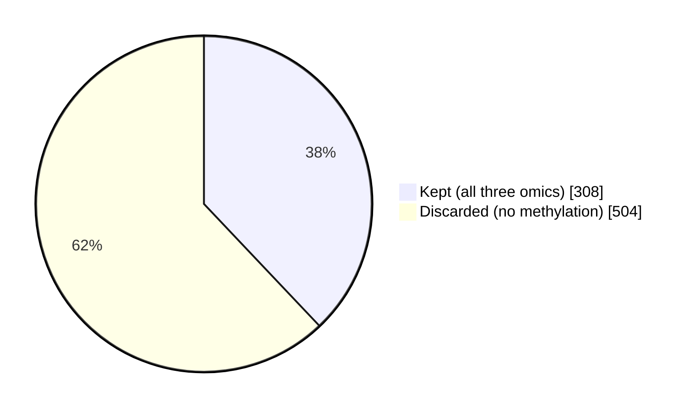
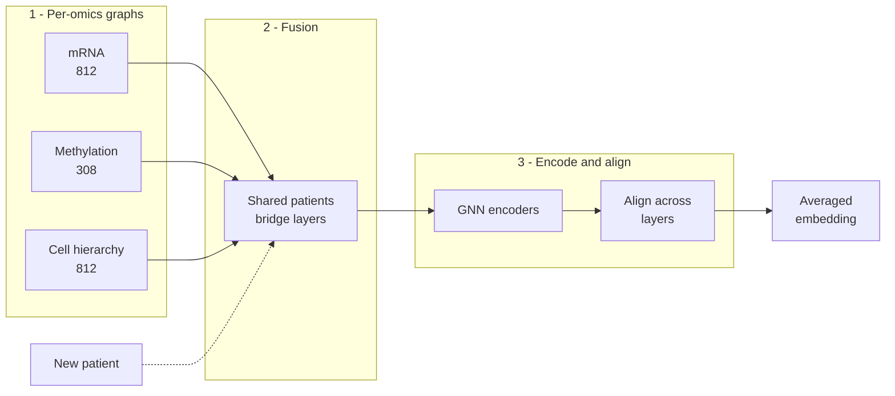
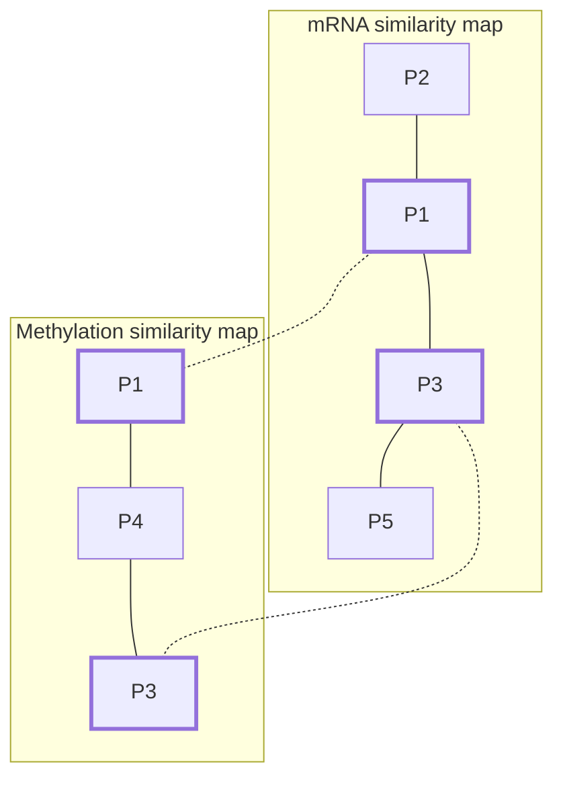

## Background

**Multi-omics in biomedicine.** Biological systems function through complex interactions between various 'omics (genes, transcripts, proteins, and metabolites), with no single molecular layer fully explaining disease and thus an integrated, multi-omic perspective is required. This premise now drives work at every stage of scientific translation. In research, multi-omic patient stratification defines biologically distinct disease subgroups, an approach central to oncology since The Cancer Genome Atlas and now extending to allergic disease, where DNA methylation profiling recently resolved a previously unrecognized subtype of type 2-high asthma with a distinct treatment response ([doi:10.1101/2025.08.28.25334696](https://doi.org/10.1101/2025.08.28.25334696)). In the clinic, transplant medicine combines donor-derived cell-free DNA with gene-expression profiling to detect graft rejection while reducing reliance on invasive biopsies ([doi:10.3390/jpm13081205](https://doi.org/10.3390/jpm13081205)). In industry, multi-omics increasingly anchors AI-driven drug discovery: rentosertib, a fibrosis therapy, emerged when transcriptomic profiles of fibrotic and healthy lung tissue were integrated with text-mined literature and clinical trial data to nominate the kinase TNIK as a novel anti-fibrotic target ([doi:10.1038/s41587-024-02143-0](https://doi.org/10.1038/s41587-024-02143-0)), after which its inhibitor was generatively designed; it became the first such drug to report positive clinical trial results and has advanced to Phase III ([doi:10.1038/s41591-025-03743-2](https://doi.org/10.1038/s41591-025-03743-2)).

**What missing data is.** A principal challenge to multi-omic integration is missing data: for a given sample, one or more omics layers may simply not be measured, due to cost, instrument sensitivity, or other experimental factors. Statistically, missingness is classified into three types (Rubin, 1976): **MCAR** (missing completely at random), where missingness is unrelated to any variable; **MAR** (missing at random), where missingness depends only on other observed variables; and **MNAR** (missing not at random), where missingness depends on the unobserved value itself, e.g., a measurement falling below an instrument's detection limit. Omics data are typically MAR or MNAR, since instruments have fixed detection thresholds and biomolecules have biochemical dependencies on one another, as summarized in [doi:10.3389/frai.2023.1098308](https://doi.org/10.3389/frai.2023.1098308).

**Traditional methods and their limits.** Two traditional strategies exist for handling missing omics data. Case deletion, i.e., complete-case or available-case analysis, simply *discards samples or features with missing values*; this is only statistically unbiased under the MCAR assumption and throws away potentially useful data. Imputation instead fills in missing values, ranging from *simple substitution (mean, zero, or limit-of-detection) to more sophisticated regression*, KNN, random forest, or EM-based approaches. These were mostly developed for a single omics layer, so applying them naively across omics layers often compromises the biological diversity and dependencies between features.

The cost of case deletion is easy to underestimate. In the AML cohort later used to evaluate IntegrAO, 812 patients had mRNA expression and cell hierarchy data, but only 308 of them also had DNA methylation profiled. Requiring complete cases would therefore discard 504 patients, roughly 62% of the cohort, purely because one assay was never run on them.

***Figure 1. Case deletion discards most of the cohort.** Of 812 AML patients profiled for mRNA expression and cell hierarchy composition, only 308 also had DNA methylation data. A complete-case analysis retains just those 308 and discards the remaining 504 (62%), despite their other omics layers being fully measured.*

**How AI/ML methods handle it.** More recent AI/ML integration methods instead build missing-data handling directly into the model, avoiding a separate imputation pre-processing step. These fall into two broad strategies. Joint-imputation methods (e.g., FBM, iMODA, MOFA/MOFA+, BIDIFAC+) estimate missing values simultaneously with model fitting, typically via Gibbs sampling or an EM algorithm. Optimization-masking methods (e.g., TiMEG, COMBI, MVAE, DeepMF, NEMO, MONET, SUMO) instead mask out the missing components of the loss or likelihood function, so only observed values contribute to parameter estimation, without imputing values or dropping the sample entirely. Both strategies recur across early (concatenation-based), middle (latent-space or transformation-based), and late (model-fusion-based) integration architectures.

**Common problems.** Across nearly all reviewed methods, predictive or clustering performance degrades as the proportion of missing data increases, though gracefully rather than requiring complete cases outright. Most methods were also validated primarily on **sequencing-based omics** (transcriptomics, genomics, methylation) rather than **mass-spectrometry-based data** (proteomics, metabolomics), which have distinct and often more complex missingness patterns. Furthermore, for cancer patients specifically, the critical task of accurately classifying new patients with partial omics data into existing subtypes is commonly overlooked by these frameworks.

**IntegrAO.** [IntegrAO](https://doi.org/10.1038/s42256-024-00942-3) was proposed to directly address this gap in 2025.

Integrate Any Omics (IntegrAO) is an unsupervised framework for integrating incomplete multi-omics data and classifying new samples. IntegrAO targets two distinct gaps left by prior methods: first, integrating patient omics data **with only partial overlap** across modalities, so that a patient missing an entire assay is neither dropped nor assigned imputed values for that assay; and second, accurately classifying newly seen patients into existing molecular subtypes **using whatever subset of omics happens to be available** for them, a task the authors note is commonly overlooked despite its clinical importance, since **physicians often must act on partial profiles**.

## Method

IntegrAO first combines **partially overlapping patient graphs** from diverse omics sources and utilizes **graph neural networks** to produce unified patient embeddings. The framework has two components: transductive integration, which builds a shared representation from the available cohort, and inductive prediction, which extends that representation to classify new, unseen patients.

***Figure 2. The IntegrAO pipeline.** Each omics layer yields its own patient similarity graph, covering only the patients measured on that assay. Partial-overlap fusion uses patients shared between layers as bridges to propagate information across graphs, with the strength of that exchange scaled by how much the layers overlap. Graph neural network encoders then embed patients from the fused graphs, an alignment step pulls the same patient's embeddings from different layers together, and the final representation averages only over the omics each patient actually has. The dashed arrow shows inductive prediction: a new patient with any subset of omics is fused into the existing graphs and positioned without retraining.*

**An intuition for the fusion step.** Each omics layer can be pictured as its own social network over the same patients, where an edge means "these two look alike in this assay." Not every patient appears in every network. Fusion works because patients measured in two layers act as mutual acquaintances who introduce their contacts, letting each network be refined by what the others know; even a patient present in only one layer benefits, since their neighbours have been introduced around. How much one network trusts another is scaled by how many patients they share. The encoder then learns not a fixed position for each patient, but a rule for placing any patient given who their neighbours are, which is precisely what allows a previously unseen patient to be positioned at inference without retraining.

**Transductive integration.** For each omics modality, IntegrAO builds a patient similarity graph, with edge weights reflecting pairwise similarity between patients, then iteratively fuses these graphs using shared patients as bridges to propagate information across modalities, building on the authors' earlier similarity network fusion method. The degree of fusion between two modalities is scaled by how many patients they share: with few shared patients, fusion is damped to avoid injecting noise; with many, information flow is maximized. Omics-specific graph neural network encoders, inspired by GraphSAGE, then extract low-dimensional patient embeddings from the fused graphs, which are aligned into a common latent space via a shared projection head. Training jointly optimizes a reconstruction loss, which preserves each modality's similarity structure, and an alignment loss, which minimizes the distance between a given patient's embeddings across modalities. Final patient embeddings are obtained by averaging across whichever modalities each patient has, so a patient missing a modality is simply averaged over fewer views rather than dropped or imputed.

**Inductive prediction.** Once subtypes are defined by clustering the integrated graph, IntegrAO is fine-tuned by adding a classification head and jointly optimizing the reconstruction, alignment, and classification losses. At inference, a new patient's available omics data are fused into the existing graph, and the fine-tuned model predicts their subtype from any combination of available modalities.

**Datasets.** IntegrAO was evaluated on three types of data. A simulated cancer omics dataset (500 samples across 15 clusters, three omics modalities generated via the InterSim package) was used to systematically test robustness under controlled missingness and overlap ratios. Five TCGA cancer cohorts (BRCA, COAD, SKCM, KIRC, LUAD) with six omics modalities (mRNA expression, DNA methylation, miRNA expression, reverse-phase protein array, copy number variation, and deconvolved cell-type composition) formed the pan-cancer benchmark. A merged acute myeloid leukaemia (AML) dataset, combining the TCGA, BEAT-AML, and Leucegene cohorts, provided mRNA expression and cell hierarchy composition for 812 patients, with additional DNA methylation available for a subset of 308 of those patients. The authors' systematic evaluation across these five cancer cohorts and six omics modalities demonstrated IntegrAO's robustness to missing data and its accuracy in classifying new samples with partial profiles, benchmarked throughout against two other partial multi-omics integration methods, NEMO and MSNE, and, for new-patient classification, against MLP, SVM, random forest, XGBoost, and kNN.

**To put it plainly,** the problem IntegrAO solves is that different patients have been measured in different ways, and most methods insist on a rectangular table where every patient has every measurement.

***Table 1. The rectangular-table assumption.** Patients are measured on whichever assays were available to them, producing a ragged rather than rectangular dataset. Methods requiring complete cases keep only the fully measured rows, discarding patients whose other assays were successfully run. Imputation instead fills the empty cells with estimated values, which downstream models then treat as though they had been measured.*

| Patient | mRNA    | Cell hierarchy | Methylation | Complete-case |
| ------- | :-----: | :------------: | :---------: | ------------- |
| P1      | yes     |      yes       |     yes     | kept          |
| P2      | yes     |      yes       |   not run   | discarded     |
| P3      | yes     |      yes       |     yes     | kept          |
| P4      | not run |      yes       |     yes     | discarded     |
| P5      | yes     |      yes       |   not run   | discarded     |

IntegrAO takes a different route. Rather than comparing patients on raw measurements, it asks a simpler question within each assay separately: **who resembles whom**? That produces one similarity map per assay, and crucially, each map only needs to cover the patients that assay actually measured, so nothing is deleted and nothing is invented. Patients who happen to appear in two maps then serve as reference points connecting them, letting each map be refined by what the others know. The more patients two assays share, the more they are allowed to influence each other, which keeps a sparse overlap from injecting noise.

***Figure 3. Similarity maps linked by shared patients.** Each assay yields its own map, in which patients are joined by resemblance, and each map covers only the patients that assay measured: P4 was never profiled for mRNA, while P2 and P5 lack methylation (Table 1; the cell hierarchy assay is omitted here for clarity). Patients measured in both assays, P1 and P3 (bold outlines, joined by dotted links), anchor the two maps together and allow each to be refined by the other. Through these anchors, even a patient appearing in a single map, such as P5, is positioned more accurately, because their neighbours have been informed by the other assay. Under complete-case analysis, only P1 and P3 would survive.*

A neural network then places every patient into a single shared space, positioning each one according to their neighbours in the refined maps and pulling the same patient's positions from different assays together until they coincide. Because a patient's coordinates come from averaging only the assays they actually have, a missing assay simply means one fewer contribution rather than a disqualification. And because the network learns a general rule for placing patients based on their neighbours, rather than memorizing fixed coordinates, a new patient walking in with whatever tests happen to be on file can be positioned in that same space and assigned a subtype without retraining anything. Missing data stops being an obstacle to remove before analysis and becomes a condition the method is built to operate under.

## Validation

An acute myeloid leukaemia case study further validates its capability to uncover biological and clinical heterogeneities in incomplete datasets, alongside three other lines of evidence in the paper.

**Robustness to missing data on simulated data.** Benchmarked against NEMO and MSNE on the simulated dataset using normalized mutual information against ground-truth clusters, IntegrAO consistently outperformed both across every missingness scenario tested: uniform subsampling with one intact modality (10-90% overlap), no intact modality at all (down to 10% overlap), and even a scenario with no samples common to all three modalities at once, using only pairwise overlap (10-33%), a case where NEMO, which requires at least one view shared across all samples, degraded substantially.

**AML case study.** Applied to the 812 merged TCGA, BEAT-AML, and Leucegene AML patients (mRNA expression and cell hierarchy composition, with DNA methylation for the 308-patient subset), IntegrAO identified 12 biologically and clinically distinct subtypes, refining prior classifications based on cell hierarchy alone. These subtypes showed significant differences in survival (log-rank $P = 1.21 \times 10^{-7}$), remained independently prognostic alongside four established clinical factors (age, cytogenetic risk, white blood cell count, and NPM1 mutation status; $P = 0.035$), and showed differential sensitivity to 47 of 122 tested anti-cancer drugs.

**Pan-cancer subtype benchmarking.** Across five TCGA cancer types, IntegrAO more consistently produced subtypes with better survival differentiation and clinical-variable enrichment than NEMO or MSNE, each of which performed well in some cancers and poorly in others.

**New patient classification.** In tenfold cross-validation across the same five cancer types, IntegrAO outperformed MLP, SVM, random forest, XGBoost, and kNN classifiers on accuracy, F1-macro, and F1-weighted scores, and stayed stable across different combinations of available omics where the other methods fluctuated. When trained with only 30% of samples having complete data, IntegrAO still outperformed the best baseline methods trained on fully complete data.

## Conclusion

IntegrAO's ability to handle heterogeneous and incomplete data makes it an essential tool for precision oncology, offering a holistic approach to patient characterization. Its core architectural strength is a pairwise, rather than all-way, graph fusion strategy: fusion between any two modalities is dynamically scaled by how many patients they share, minimizing noise when overlap is low and maximizing information flow when it is high, without ever requiring a sample to be observed across every modality.

The authors also point to open limitations and next steps. The graph fusion step is not yet end-to-end differentiable, which they suggest re-architecting as a neural network for efficiency, and the framework could extend beyond cancer to other diseases. Incorporating additional data types, such as histopathology images, clinical notes, or real-time sensor data, could produce a more complete view of each patient. More broadly, the paper flags incomplete feature sets across omics platforms, data quality variability across instruments, and limited interpretability as unresolved challenges for multi-omics integration generally, framing explainable AI as a priority for clinical adoption.

Despite the paper's genome-wide framing, each modality is aggressively reduced before integration: the TCGA benchmark keeps the top 2,000 features by standard deviation per modality, and the AML methylation data is reduced to 2,000 highly variable features selected by dispersion, from arrays that originally carry hundreds of thousands of probes. Gene expression and cell composition in the AML cohort are compressed further, to 30 dimensions, during batch correction. Because IntegrAO constructs its patient graphs from Euclidean distances between feature vectors, this upstream reduction determines what "similarity" means, and top-variance features in tumour data often track tumour purity and cell composition as much as the biology of interest.

IntegrAO removes the need to impute an entire missing assay, but scattered missing values within a matrix are still handled conventionally: the TCGA data were kNN-imputed within each modality, and patients with more than 20% missingness in any data type, along with features missing in more than 20% of patients, were excluded outright. The framework therefore addresses block-level missingness, where a patient lacks a whole assay, while entry-level missingness remains a preprocessing problem solved by the very imputation and case-deletion strategies the method is positioned against.

Also, the TCGA matrices were taken from cBioPortal, and no methylation-specific processing is reported, such as beta-to-M-value transformation, filtering of cross-reactive or SNP-overlapping probes, or array normalization. This is reasonable for a paper benchmarking integration rather than measurement, but it means the pipeline should not be read as a template for methylation-first analyses.
